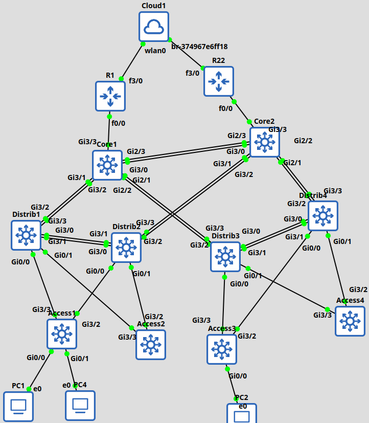

# Rapport TP3 - Evolution Architecture

## VLSM

| VLAN                | Adresse réseau | Gateway    |
| ------------------- | -------------- | ---------- |
| VLAN 10 (Marketing) | 10.0.0.32/27   | 10.0.0.33  |
| VLAN 20 (Dév)       | 10.0.0.0/27    | 10.0.0.1   |
| VLAN 30 (IT)        | 10.0.0.64/27   | 10.0.0.65  |
| VLAN 40 (RH)        | 10.0.0.96/27   | 10.0.0.97  |
| VLAN 50 (Admin)     | 10.0.0.128/27  | 10.0.0.129 |
Tout est en /27 car en utilisant la plage d'address IP "10.0.0.0", on possède énormément d'IP disponible. Je prends donc la responsabilité de mettre un masque plus grands que les besoins présent afin d'être moins embêté plus tard.

## Schéma architecture




## Les configurations :

### VLAN
Pareil sur tous les switchs

```
#sh vlan
VLAN Name                             Status    Ports
---- -------------------------------- --------- -------------------------------
1    default                          active    Gi0/0, Gi0/1, Gi0/2, Gi0/3
                                                Gi1/0, Gi1/1, Gi1/2, Gi1/3
                                                Gi2/0
10   marketing                        active    
20   developpement                    active    
30   IT                               active    
40   RH                               active    
50   administration                   active    
1002 fddi-default                     act/unsup 
1003 token-ring-default               act/unsup 
1004 fddinet-default                  act/unsup 
1005 trnet-default                    act/unsup 

VLAN Type  SAID       MTU   Parent RingNo BridgeNo Stp  BrdgMode Trans1 Trans2
---- ----- ---------- ----- ------ ------ -------- ---- -------- ------ ------
1    enet  100001     1500  -      -      -        -    -        0      0   
10   enet  100010     1500  -      -      -        -    -        0      0   
20   enet  100020     1500  -      -      -        -    -        0      0   
30   enet  100030     1500  -      -      -        -    -        0      0   
40   enet  100040     1500  -      -      -        -    -        0      0   
          
VLAN Type  SAID       MTU   Parent RingNo BridgeNo Stp  BrdgMode Trans1 Trans2
---- ----- ---------- ----- ------ ------ -------- ---- -------- ------ ------
50   enet  100050     1500  -      -      -        -    -        0      0   
1002 fddi  101002     1500  -      -      -        -    -        0      0   
1003 tr    101003     1500  -      -      -        -    -        0      0   
1004 fdnet 101004     1500  -      -      -        ieee -        0      0   
1005 trnet 101005     1500  -      -      -        ibm  -        0      0   

Remote SPAN VLANs
------------------------------------------------------------------------------


Primary Secondary Type              Ports
------- --------- ----------------- ------------------------------------------
```

### MST configuration
Pareil sur tous les switchs, pour que les instances soient bien appliquées

```
#sh spanning-tree mst configuration 
Name      []
Revision  0     Instances configured 4

Instance  Vlans mapped
--------  ---------------------------------------------------------------------
0         1-9,11-19,21-29,31-39,41-49,51-4094
1         10,20
2         40,50
3         30
-------------------------------------------------------------------------------
```

### Sécurité par port (VLAN IT)

```
#sh run
.....
interface GigabitEthernet0/0
 switchport access vlan 30
 switchport mode access
 switchport port-security maximum 2
 switchport port-security
 spanning-tree portfast edge
......
```
**Remarque :** l'action de violation, par défaut, du port-security est "shutdown", la ligne n'apparais donc pas lorsque l'on configure manuellement cette option.

### ACLs

J'ai choisis de faire 1 ACL-list par VLAN, afin de contrôler les VLANs individuellement.  
A noter que par défaut, une access-list se termine par la règle `deny ip any any`. Donc si aucune règle ne match, alors par défaut la trame est `deny`

- ACL_MARK => access-list pour VLAN 10 (Marketing)
  règle 1 : On bloque le trafic vers les autres VLANs
  règle 2 : On autorise le trafic vers n'importe ou (internet)
```
ip access-list extended ACL_MARK
 deny   ip 10.0.0.32 0.0.0.31 10.0.0.0 0.0.0.255
 permit ip 10.0.0.32 0.0.0.31 any
```

- ACL_DEV => access-list pour VLAN 20 (Developpement)
  règle 1 : On autorise le trafic vers le serveur `10.0.0.71`
  règle 2 : On autorise le trafic vers le serveur `10.0.0.72`
  règle 3 : On autorise le trafic vers le serveur `10.0.0.73`
```
ip access-list extended ACL_DEV
 permit ip 10.0.0.0 0.0.0.31 host 10.0.0.71
 permit ip 10.0.0.0 0.0.0.31 host 10.0.0.72
 permit ip 10.0.0.0 0.0.0.31 host 10.0.0.73
```

- ACL_IT => access-list pour VLAN 30 (IT)
  règle 1 : autorise le trafic dans tous les VLANs
```
ip access-list extended ACL_IT
 permit ip 10.0.0.64 0.0.0.31 10.0.0.0 0.0.0.255
```

- ACL_RH => access-list pour VLAN 40 (RH)
  règle 1 : autorise le trafic vers le serveur RH (`10.0.0.70`)
```
ip access-list extended ACL_RH
 permit ip 10.0.0.96 0.0.0.31 host 10.0.0.70
```

- ACL_ADMIN => access-list pour VLAN 50 (Administration)
  même règles que pour l'access-list ACL_MARK (modulo le changement des IP sources pour correspondre au VLAN 50)
```
ip access-list extended ACL_ADMIN
 deny   ip 10.0.0.128 0.0.0.31 10.0.0.0 0.0.0.255
 permit ip 10.0.0.128 0.0.0.31 any
```

