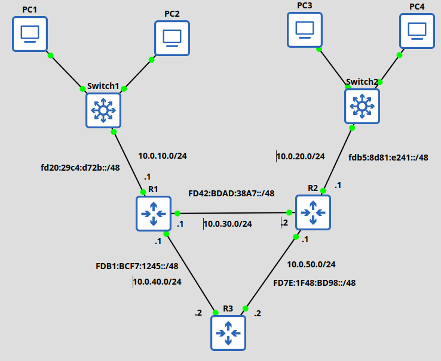

# Rapport TP4 : Configuration IPv6

## Schéma architecture



## Configuration IPv6

- R1 :

```
R1#sh ipv6 interface 
FastEthernet0/0 is up, line protocol is up
  IPv6 is enabled, link-local address is FE80::C801:58FF:FE53:0 
  No Virtual link-local address(es):
  Global unicast address(es):
    FD20:29C4:D72B::1, subnet is FD20:29C4:D72B::/48 
  Joined group address(es):
    FF02::1
    FF02::1:FF00:1
    FF02::1:FF53:0
  MTU is 1500 bytes
  ICMP error messages limited to one every 100 milliseconds
  ICMP redirects are enabled
  ICMP unreachables are sent
  ND DAD is enabled, number of DAD attempts: 1
  ND reachable time is 30000 milliseconds (using 30000)
  ND advertised reachable time is 0 (unspecified)
  ND advertised retransmit interval is 0 (unspecified)
  ND router advertisements are sent every 200 seconds
  ND router advertisements live for 1800 seconds
  ND advertised default router preference is Medium
  Hosts use stateless autoconfig for addresses.
FastEthernet3/0 is up, line protocol is up
  IPv6 is enabled, link-local address is FE80::C801:58FF:FE53:54 
  No Virtual link-local address(es):
  Global unicast address(es):
    FDB1:BCF7:1245::1, subnet is FDB1:BCF7:1245::/48 
  Joined group address(es):
    FF02::1
    FF02::2
    FF02::1:FF00:1
    FF02::1:FF53:54
  MTU is 1500 bytes
  ICMP error messages limited to one every 100 milliseconds
  ICMP redirects are enabled
  ICMP unreachables are sent
  ND DAD is enabled, number of DAD attempts: 1
  ND reachable time is 30000 milliseconds (using 30000)
  ND advertised reachable time is 0 (unspecified)
  ND advertised retransmit interval is 0 (unspecified)
  ND router advertisements are sent every 200 seconds
  ND router advertisements live for 1800 seconds
  ND advertised default router preference is Medium
  Hosts use stateless autoconfig for addresses.
FastEthernet4/0 is up, line protocol is up
  IPv6 is enabled, link-local address is FE80::C801:58FF:FE53:70 
  No Virtual link-local address(es):
  Global unicast address(es):
    FD42:BDAD:38A7::1, subnet is FD42:BDAD:38A7::/48 
  Joined group address(es):
    FF02::1
    FF02::2
    FF02::1:FF00:1
    FF02::1:FF53:70
  MTU is 1500 bytes
  ICMP error messages limited to one every 100 milliseconds
  ICMP redirects are enabled
  ICMP unreachables are sent
  ND DAD is enabled, number of DAD attempts: 1
  ND reachable time is 30000 milliseconds (using 30000)
  ND advertised reachable time is 0 (unspecified)
  ND advertised retransmit interval is 0 (unspecified)
  ND router advertisements are sent every 200 seconds
  ND router advertisements live for 1800 seconds
  ND advertised default router preference is Medium
  Hosts use stateless autoconfig for addresses.
```

- R2 :

```
FastEthernet0/0 is up, line protocol is up
  IPv6 is enabled, link-local address is FE80::C803:58FF:FE8F:0 
  No Virtual link-local address(es):
  Global unicast address(es):
    FDB5:8D81:E241::1, subnet is FDB5:8D81:E241::/48 
  Joined group address(es):
    FF02::1
    FF02::2
    FF02::1:FF00:1
    FF02::1:FF8F:0
  MTU is 1500 bytes
  ICMP error messages limited to one every 100 milliseconds
  ICMP redirects are enabled
  ICMP unreachables are sent
  ND DAD is enabled, number of DAD attempts: 1
  ND reachable time is 30000 milliseconds (using 30000)
  ND advertised reachable time is 0 (unspecified)
  ND advertised retransmit interval is 0 (unspecified)
  ND router advertisements are sent every 200 seconds
  ND router advertisements live for 1800 seconds
  ND advertised default router preference is Medium
  Hosts use stateless autoconfig for addresses.
FastEthernet3/0 is up, line protocol is up
  IPv6 is enabled, link-local address is FE80::C803:58FF:FE8F:54 
  No Virtual link-local address(es):
  Global unicast address(es):
    FD7E:1F48:BD98::1, subnet is FD7E:1F48:BD98::/48 
  Joined group address(es):
    FF02::1
    FF02::2
    FF02::1:FF00:1
    FF02::1:FF8F:54
  MTU is 1500 bytes
  ICMP error messages limited to one every 100 milliseconds
  ICMP redirects are enabled
  ICMP unreachables are sent
  ND DAD is enabled, number of DAD attempts: 1
  ND reachable time is 30000 milliseconds (using 30000)
  ND advertised reachable time is 0 (unspecified)
  ND advertised retransmit interval is 0 (unspecified)
  ND router advertisements are sent every 200 seconds
  ND router advertisements live for 1800 seconds
  ND advertised default router preference is Medium
  Hosts use stateless autoconfig for addresses.
FastEthernet4/0 is up, line protocol is up
  IPv6 is enabled, link-local address is FE80::C803:58FF:FE8F:70 
  No Virtual link-local address(es):
  Global unicast address(es):
    FD42:BDAD:38A7::2, subnet is FD42:BDAD:38A7::/48 
  Joined group address(es):
    FF02::1
    FF02::2
    FF02::1:FF00:2
    FF02::1:FF8F:70
  MTU is 1500 bytes
  ICMP error messages limited to one every 100 milliseconds
  ICMP redirects are enabled
  ICMP unreachables are sent
  ND DAD is enabled, number of DAD attempts: 1
  ND reachable time is 30000 milliseconds (using 30000)
  ND advertised reachable time is 0 (unspecified)
  ND advertised retransmit interval is 0 (unspecified)
  ND router advertisements are sent every 200 seconds
  ND router advertisements live for 1800 seconds
  ND advertised default router preference is Medium
  Hosts use stateless autoconfig for addresses.
```

- R3 :

```
R3#sh ipv6 interface 
FastEthernet3/0 is up, line protocol is up
  IPv6 is enabled, link-local address is FE80::C802:58FF:FE73:54 
  No Virtual link-local address(es):
  Global unicast address(es):
    FD7E:1F48:BD98::2, subnet is FD7E:1F48:BD98::/48 
  Joined group address(es):
    FF02::1
    FF02::2
    FF02::1:FF00:2
    FF02::1:FF73:54
  MTU is 1500 bytes
  ICMP error messages limited to one every 100 milliseconds
  ICMP redirects are enabled
  ICMP unreachables are sent
  ND DAD is enabled, number of DAD attempts: 1
  ND reachable time is 30000 milliseconds (using 30000)
  ND advertised reachable time is 0 (unspecified)
  ND advertised retransmit interval is 0 (unspecified)
  ND router advertisements are sent every 200 seconds
  ND router advertisements live for 1800 seconds
  ND advertised default router preference is Medium
  Hosts use stateless autoconfig for addresses.
FastEthernet4/0 is up, line protocol is up
  IPv6 is enabled, link-local address is FE80::C802:58FF:FE73:70 
  No Virtual link-local address(es):
  Global unicast address(es):
    FDB1:BCF7:1245::2, subnet is FDB1:BCF7:1245::/48 
  Joined group address(es):
    FF02::1
    FF02::2
    FF02::1:FF00:2
    FF02::1:FF73:70
  MTU is 1500 bytes
  ICMP error messages limited to one every 100 milliseconds
  ICMP redirects are enabled
  ICMP unreachables are sent
  ND DAD is enabled, number of DAD attempts: 1
  ND reachable time is 30000 milliseconds (using 30000)
  ND advertised reachable time is 0 (unspecified)
  ND advertised retransmit interval is 0 (unspecified)
  ND router advertisements are sent every 200 seconds
  ND router advertisements live for 1800 seconds
  ND advertised default router preference is Medium
  Hosts use stateless autoconfig for addresses.
```

## Routage statique IPv6

- R1 :
```
R1#sh ipv6 route
IPv6 Routing Table - default - 8 entries
Codes: C - Connected, L - Local, S - Static, U - Per-user Static route
       B - BGP, R - RIP, H - NHRP, I1 - ISIS L1
       I2 - ISIS L2, IA - ISIS interarea, IS - ISIS summary, D - EIGRP
       EX - EIGRP external, ND - ND Default, NDp - ND Prefix, DCE - Destination
       NDr - Redirect, O - OSPF Intra, OI - OSPF Inter, OE1 - OSPF ext 1
       OE2 - OSPF ext 2, ON1 - OSPF NSSA ext 1, ON2 - OSPF NSSA ext 2, l - LISP
C   FD20:29C4:D72B::/48 [0/0]
     via FastEthernet0/0, directly connected
L   FD20:29C4:D72B::1/128 [0/0]
     via FastEthernet0/0, receive
C   FD42:BDAD:38A7::/48 [0/0]
     via FastEthernet4/0, directly connected
L   FD42:BDAD:38A7::1/128 [0/0]
     via FastEthernet4/0, receive
C   FDB1:BCF7:1245::/48 [0/0]
     via FastEthernet3/0, directly connected
L   FDB1:BCF7:1245::1/128 [0/0]
     via FastEthernet3/0, receive
S   FDB5:8D81:E241::/48 [1/0]
     via FD42:BDAD:38A7::2
L   FF00::/8 [0/0]
     via Null0, receive
```

- R2 :

```
R2#sh ipv6 route
IPv6 Routing Table - default - 8 entries
Codes: C - Connected, L - Local, S - Static, U - Per-user Static route
       B - BGP, R - RIP, H - NHRP, I1 - ISIS L1
       I2 - ISIS L2, IA - ISIS interarea, IS - ISIS summary, D - EIGRP
       EX - EIGRP external, ND - ND Default, NDp - ND Prefix, DCE - Destination
       NDr - Redirect, O - OSPF Intra, OI - OSPF Inter, OE1 - OSPF ext 1
       OE2 - OSPF ext 2, ON1 - OSPF NSSA ext 1, ON2 - OSPF NSSA ext 2, l - LISP
S   FD20:29C4:D72B::/48 [1/0]
     via FD42:BDAD:38A7::1
C   FD42:BDAD:38A7::/48 [0/0]
     via FastEthernet4/0, directly connected
L   FD42:BDAD:38A7::2/128 [0/0]
     via FastEthernet4/0, receive
C   FD7E:1F48:BD98::/48 [0/0]
     via FastEthernet3/0, directly connected
L   FD7E:1F48:BD98::1/128 [0/0]
     via FastEthernet3/0, receive
C   FDB5:8D81:E241::/48 [0/0]
     via FastEthernet0/0, directly connected
L   FDB5:8D81:E241::1/128 [0/0]
     via FastEthernet0/0, receive
L   FF00::/8 [0/0]
     via Null0, receive
```

- R3 :

```
R3#sh ipv6 route
IPv6 Routing Table - default - 7 entries
Codes: C - Connected, L - Local, S - Static, U - Per-user Static route
       B - BGP, R - RIP, H - NHRP, I1 - ISIS L1
       I2 - ISIS L2, IA - ISIS interarea, IS - ISIS summary, D - EIGRP
       EX - EIGRP external, ND - ND Default, NDp - ND Prefix, DCE - Destination
       NDr - Redirect, O - OSPF Intra, OI - OSPF Inter, OE1 - OSPF ext 1
       OE2 - OSPF ext 2, ON1 - OSPF NSSA ext 1, ON2 - OSPF NSSA ext 2, l - LISP
S   FD20:29C4:D72B::/48 [1/0]
     via FDB1:BCF7:1245::1
C   FD7E:1F48:BD98::/48 [0/0]
     via FastEthernet3/0, directly connected
L   FD7E:1F48:BD98::2/128 [0/0]
     via FastEthernet3/0, receive
C   FDB1:BCF7:1245::/48 [0/0]
     via FastEthernet4/0, directly connected
L   FDB1:BCF7:1245::2/128 [0/0]
     via FastEthernet4/0, receive
S   FDB5:8D81:E241::/48 [1/0]
     via FD7E:1F48:BD98::1
L   FF00::/8 [0/0]
     via Null0, receive
```