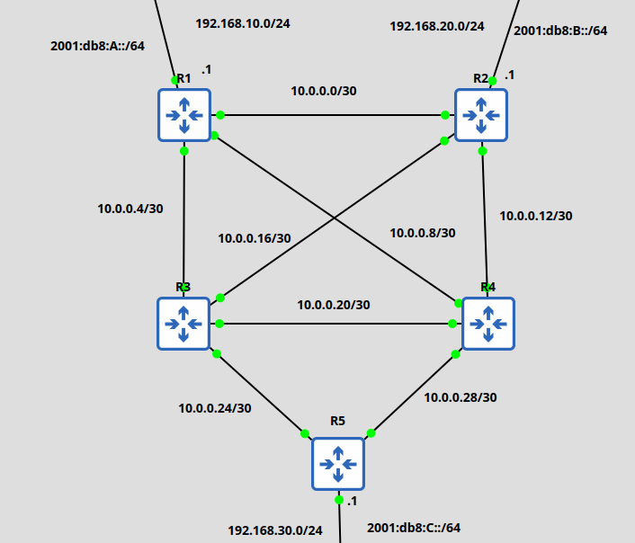

# Rapport TP5 : RIPng EIGRP

## Schéma

  


## Configuration Router avec LAN

- R1 :
```
interface FastEthernet0/0
 ip address 192.168.10.1 255.255.255.0
 duplex full
 ipv6 address 2001:DB8:A::1/64
 ipv6 enable
 ipv6 nd prefix 2001:DB8:A::/64
 ipv6 rip RIPng_TP4 enable
!
interface FastEthernet1/0
 no ip address
 shutdown
 duplex full
!
interface FastEthernet2/0
 ip address 10.0.0.9 255.255.255.252
 duplex full
 ipv6 enable
 ipv6 rip RIPng_TP4 enable
!
interface FastEthernet3/0
 ip address 10.0.0.5 255.255.255.252
 duplex full
 ipv6 enable
 ipv6 rip RIPng_TP4 enable
!
interface FastEthernet4/0
 ip address 10.0.0.1 255.255.255.252
 duplex full
 ipv6 enable
 ipv6 rip RIPng_TP4 enable
!
!
router eigrp 100
 network 10.0.0.0 0.0.0.3
 network 10.0.0.4 0.0.0.3
 network 10.0.0.8 0.0.0.3
 network 192.168.10.0
 passive-interface FastEthernet0/0
!
.....
!
ipv6 router rip RIPng_TP4
```

## Configuration Router sans LAN

- R3 :

```
interface FastEthernet0/0
 no ip address
 shutdown
 duplex full
!
interface FastEthernet1/0
 ip address 10.0.0.25 255.255.255.252
 duplex full
 ipv6 enable
 ipv6 rip RIPng_TP4 enable
!
interface FastEthernet2/0
 ip address 10.0.0.21 255.255.255.252
 duplex full
 ipv6 enable
 ipv6 rip RIPng_TP4 enable
!         
interface FastEthernet3/0
 ip address 10.0.0.18 255.255.255.252
 duplex full
 ipv6 enable
 ipv6 rip RIPng_TP4 enable
!
interface FastEthernet4/0
 ip address 10.0.0.6 255.255.255.252
 duplex full
 ipv6 enable
 ipv6 rip RIPng_TP4 enable
!
!
router eigrp 100
 network 10.0.0.4 0.0.0.3
 network 10.0.0.16 0.0.0.3
 network 10.0.0.20 0.0.0.3
 network 10.0.0.24 0.0.0.3
!
.....
!
ipv6 router rip RIPng_TP4
```

## Table de routage d'un router central

- IPv6

```
R3#sh ipv6 route
IPv6 Routing Table - default - 4 entries
Codes: C - Connected, L - Local, S - Static, U - Per-user Static route
       B - BGP, R - RIP, H - NHRP, I1 - ISIS L1
       I2 - ISIS L2, IA - ISIS interarea, IS - ISIS summary, D - EIGRP
       EX - EIGRP external, ND - ND Default, NDp - ND Prefix, DCE - Destination
       NDr - Redirect, O - OSPF Intra, OI - OSPF Inter, OE1 - OSPF ext 1
       OE2 - OSPF ext 2, ON1 - OSPF NSSA ext 1, ON2 - OSPF NSSA ext 2, l - LISP
R   2001:DB8:A::/64 [120/2]
     via FE80::C801:58FF:FE53:54, FastEthernet4/0
R   2001:DB8:B::/64 [120/2]
     via FE80::C803:58FF:FE8F:54, FastEthernet3/0
R   2001:DB8:C::/64 [120/2]
     via FE80::C805:1BFF:FEA6:70, FastEthernet1/0
L   FF00::/8 [0/0]
     via Null0, receive
```

- IPv4

```
R3#sh ip route 
Codes: L - local, C - connected, S - static, R - RIP, M - mobile, B - BGP
       D - EIGRP, EX - EIGRP external, O - OSPF, IA - OSPF inter area 
       N1 - OSPF NSSA external type 1, N2 - OSPF NSSA external type 2
       E1 - OSPF external type 1, E2 - OSPF external type 2
       i - IS-IS, su - IS-IS summary, L1 - IS-IS level-1, L2 - IS-IS level-2
       ia - IS-IS inter area, * - candidate default, U - per-user static route
       o - ODR, P - periodic downloaded static route, H - NHRP, l - LISP
       + - replicated route, % - next hop override

Gateway of last resort is not set

      10.0.0.0/8 is variably subnetted, 12 subnets, 2 masks
D        10.0.0.0/30 [90/30720] via 10.0.0.17, 00:24:56, FastEthernet3/0
                     [90/30720] via 10.0.0.5, 00:24:56, FastEthernet4/0
C        10.0.0.4/30 is directly connected, FastEthernet4/0
L        10.0.0.6/32 is directly connected, FastEthernet4/0
D        10.0.0.8/30 [90/30720] via 10.0.0.22, 00:23:50, FastEthernet2/0
                     [90/30720] via 10.0.0.5, 00:23:50, FastEthernet4/0
D        10.0.0.12/30 [90/30720] via 10.0.0.22, 00:23:50, FastEthernet2/0
                      [90/30720] via 10.0.0.17, 00:23:50, FastEthernet3/0
C        10.0.0.16/30 is directly connected, FastEthernet3/0
L        10.0.0.18/32 is directly connected, FastEthernet3/0
C        10.0.0.20/30 is directly connected, FastEthernet2/0
L        10.0.0.21/32 is directly connected, FastEthernet2/0
C        10.0.0.24/30 is directly connected, FastEthernet1/0
L        10.0.0.25/32 is directly connected, FastEthernet1/0
D        10.0.0.28/30 [90/30720] via 10.0.0.26, 00:23:52, FastEthernet1/0
                      [90/30720] via 10.0.0.22, 00:23:52, FastEthernet2/0
D     192.168.10.0/24 [90/30720] via 10.0.0.5, 00:24:56, FastEthernet4/0
D     192.168.20.0/24 [90/30720] via 10.0.0.17, 00:24:56, FastEthernet3/0
D     192.168.30.0/24 [90/30720] via 10.0.0.26, 00:23:50, FastEthernet1/0
```

## Tests de connectivités

Depuis R3, vers un LAN IPv4 et IPv6.

```
R3#ping 192.168.20.1
Type escape sequence to abort.
Sending 5, 100-byte ICMP Echos to 192.168.20.1, timeout is 2 seconds:
!!!!!
Success rate is 100 percent (5/5), round-trip min/avg/max = 8/12/20 ms

R3#ping 2001:db8:A::1  
Type escape sequence to abort.
Sending 5, 100-byte ICMP Echos to 2001:DB8:A::1, timeout is 2 seconds:
!!!!!
Success rate is 100 percent (5/5), round-trip min/avg/max = 8/16/20 ms
```